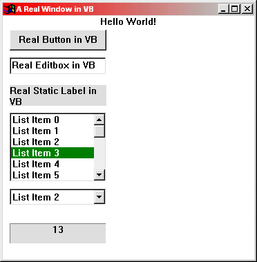



## Create a window from scratch using CreateWindowEx \(Part 2\)

### Description

This is part 2 of creating a window from scratch. This will show you how to impliment Buttons, Listbox, Combobox, Lables, Timers, etc dynamically on a window that was created from scratch. If you want the skeleton code for Part 1 go here: http://www.planetsourcecode.com/vb/scripts/ShowCode.asp?txtCodeId=34819&lngWId=1
 
### More Info
 

             |
---                |---
**Submitted On**   |2002-05-15 19:25:24
**By**             |[Andrew Heinlein \(Mouse\)](https://github.com/Planet-Source-Code/PSCIndex/blob/master/ByAuthor/andrew-heinlein-mouse.md)
**Level**          |Intermediate
**User Rating**    |5.0 (55 globes from 11 users)
**Compatibility**  |VB 5\.0, VB 6\.0
**Category**       |[Custom Controls/ Forms/  Menus](https://github.com/Planet-Source-Code/PSCIndex/blob/master/ByCategory/custom-controls-forms-menus__1-4.md)
**World**          |[Visual Basic](https://github.com/Planet-Source-Code/PSCIndex/blob/master/ByWorld/visual-basic.md)
**Archive File**   |[Create\_a\_w836285152002\.zip](https://github.com/Planet-Source-Code/andrew-heinlein-mouse-create-a-window-from-scratch-using-createwindowex-part-2__1-34831/archive/master.zip)

